### Quickstart: Create an event hub using Azure portal

In this lab:

1. Prerequisites
2. Create a resource group
3. Create an Event Hubs namespace
4. Create an event hub

Azure Event Hubs is a Big Data streaming platform and event ingestion
service that can receive and process millions of events per second.
Event Hubs can process and store events, data, or telemetry produced by
distributed software and devices. Data sent to an event hub can be
transformed and stored using any real-time analytics provider or
batching/storage adapters.

In this quickstart, you create an event hub using the [Azure
portal](https://portal.azure.com/).

Prerequisites
-----------------------------------------------------------------------------------------------------------------------------------

To complete this quickstart, make sure that you have:

-   Azure subscription. If you don\'t have one, [create a free
    account](https://azure.microsoft.com/free/) before you begin.

Create a resource group
-------------------------------------------------------------------------------------------------------------------------------------------------------

A resource group is a logical collection of Azure resources. All
resources are deployed and managed in a resource group. To create a
resource group:

1.  Sign in to the [Azure portal](https://portal.azure.com/).

2.  In the left navigation, select **Resource groups**. Then select
    **Add**.

    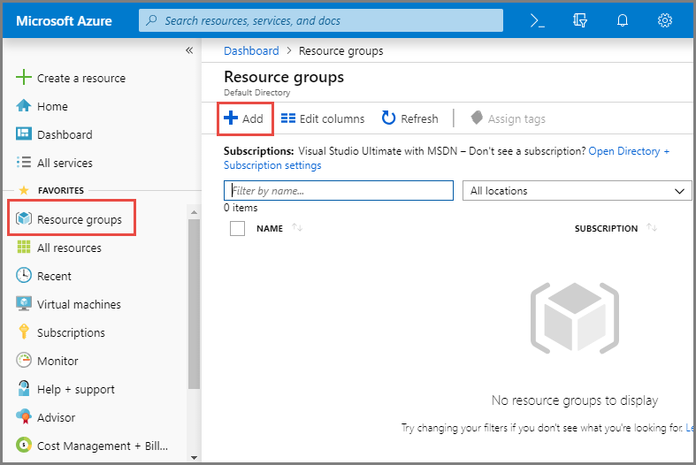

3.  For **Subscription**, select the name of the Azure subscription in
    which you want to create the resource group.

4.  Type a unique **name for the resource group**. The system
    immediately checks to see if the name is available in the currently
    selected Azure subscription.

5.  Select a **region** for the resource group.

6.  Select **Review + Create**.

    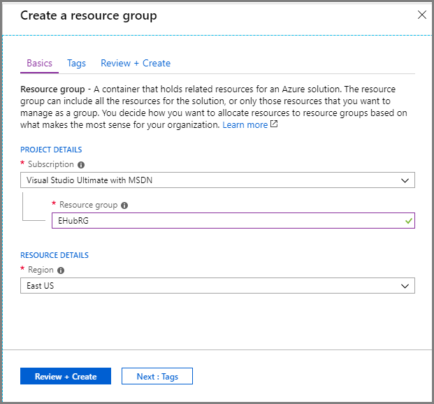

7.  On the **Review + Create** page, select **Create**.

Create an Event Hubs namespace
---------------------------------------------------------------------------------------------------------------------------------------------------------------------

An Event Hubs namespace provides a unique scoping container, in which
you create one or more event hubs. To create a namespace in your
resource group using the portal, do the following actions:

1.  In the Azure portal, and select **Create a resource** at the top
    left of the screen.

2.  Select **All services** in the left menu, and select **star (`*`)**
    next to **Event Hubs** in the **Analytics** category. Confirm that
    **Event Hubs** is added to **FAVORITES** in the left navigational
    menu.

    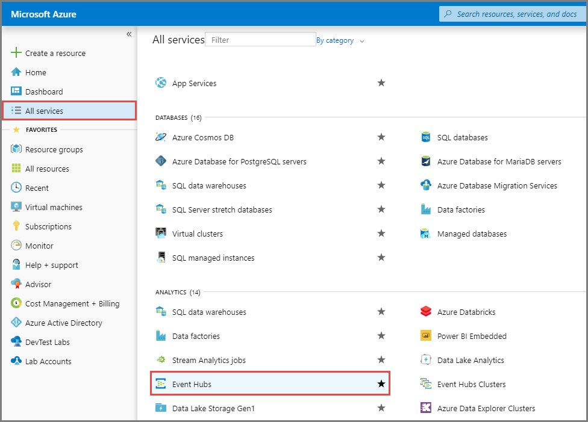

3.  Select **Event Hubs** under **FAVORITES** in the left navigational
    menu, and select **Add** on the toolbar.

    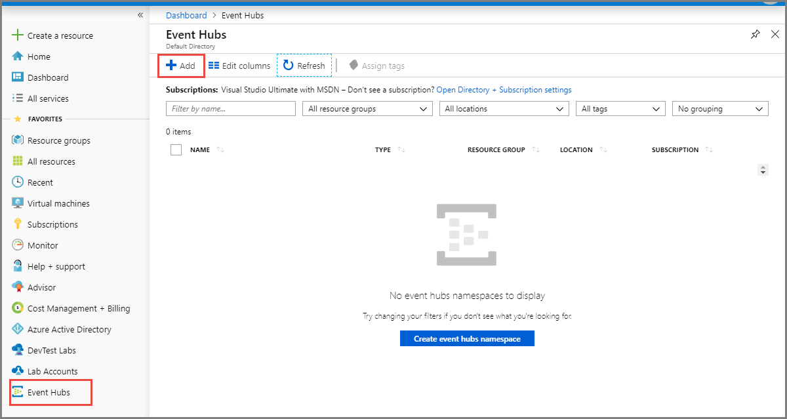

4.  On the **Create namespace** page, take the following steps:

    1.  Select the **subscription** in which you want to create the
        namespace.

    2.  Select the **resource group** you created in the previous step.

    3.  Enter a **name** for the namespace. The system immediately
        checks to see if the name is available.

    4.  Select a **location** for the namespace.

    5.  Choose **Basic** for the **pricing tier**.

    6.  Leave the **throughput units** (for standard tier) or
        **processing units** (for premium tier) settings as it is.

    7.  Select **Review + Create** at the bottom of the page.

        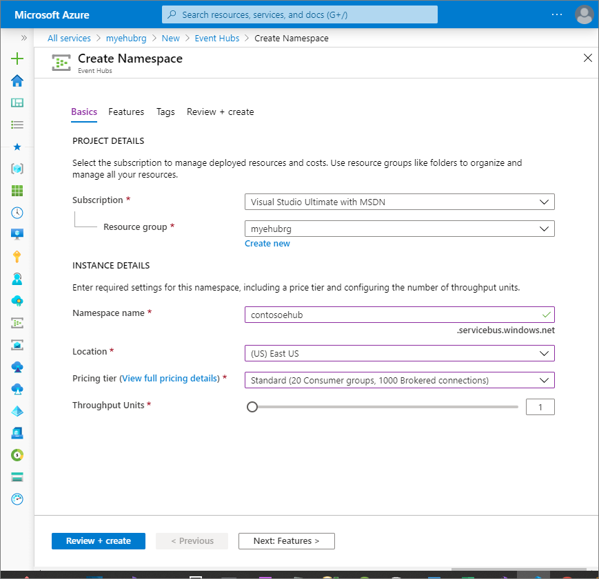

    8.  On the **Review + Create** page, review the settings, and select
        **Create**. Wait for the deployment to complete.

        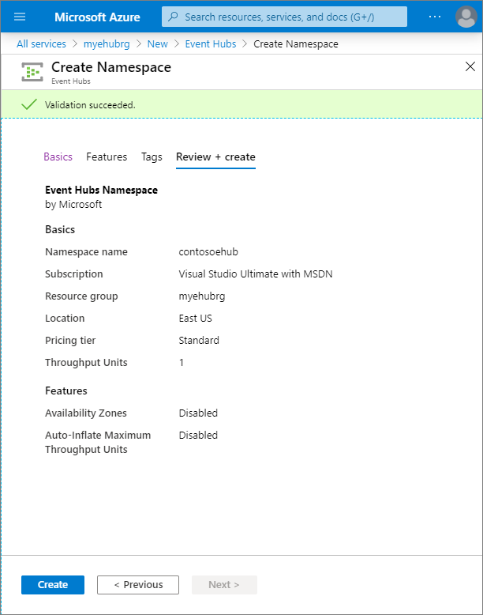

    9.  On the **Deployment** page, select **Go to resource** to
        navigate to the page for your namespace.

        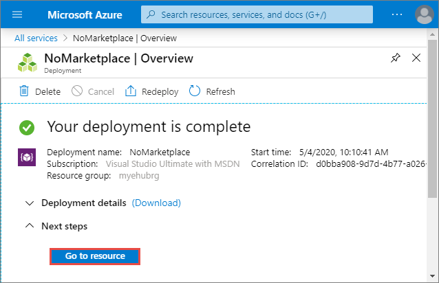

    10. Confirm that you see the **Event Hubs Namespace** page similar
        to the following example:

        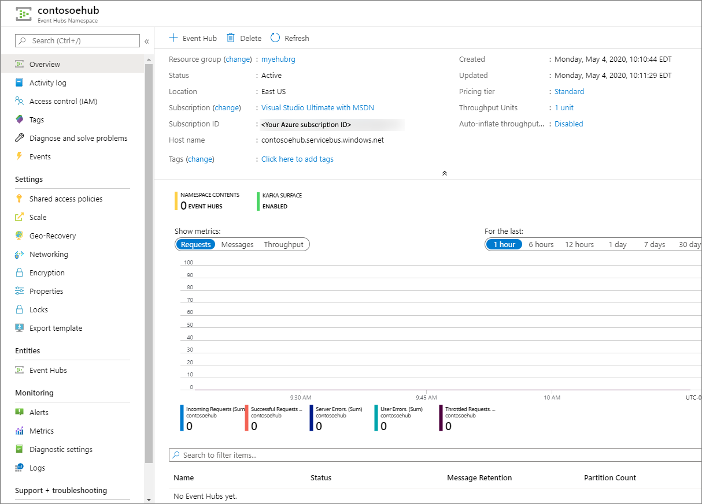

        Note

        Azure Event Hubs provides you with a Kafka endpoint. This
        endpoint enables your Event Hubs namespace to natively
        understand [Apache Kafka](https://kafka.apache.org/intro)
        message protocol and APIs. With this capability, you can
        communicate with your event hubs as you would with Kafka topics
        without changing your protocol clients or running your own
        clusters. Event Hubs supports [Apache Kafka versions
        1.0](https://kafka.apache.org/10/documentation.html) and later.
        

Create an event hub
-----------------------------------------------------------------------------------------------------------------------------------------------

To create an event hub within the namespace, do the following actions:

1.  On the Event Hubs Namespace page, select **Event Hubs** in the left
    menu.

2.  At the top of the window, select **+ Event Hub**.

    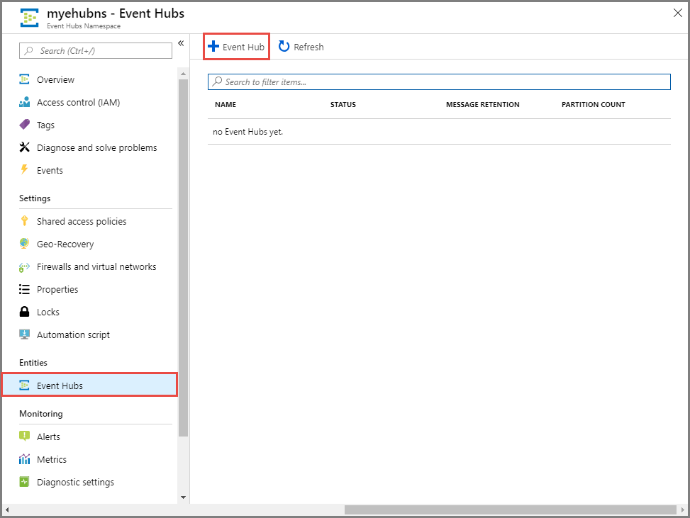

3.  Type a name for your event hub, then select **Create**.

    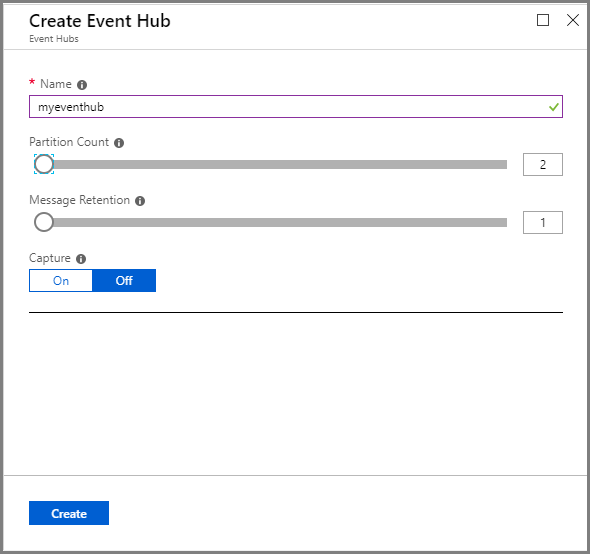

    The **partition count** setting allows you to parallelize
    consumption across many consumers.

    The **message retention** setting specifies how long the Event Hubs
    service keeps data.

4.  You can check the status of the event hub creation in alerts. After
    the event hub is created, you see it in the list of event hubs.

    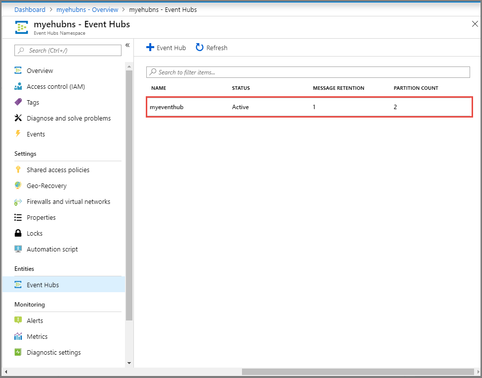
