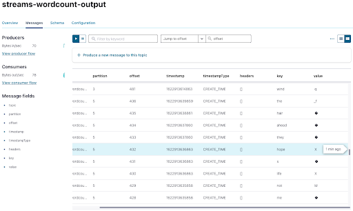
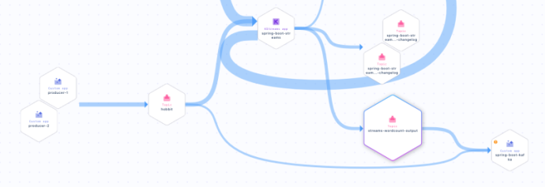

Hands On: Process Messages with KafkaStreams and Spring Boot
============================================================

In this exercise, you will process your "Hobbit" quotes, like you did in
the previous exercises, and count the number of words in each. You can
see the code for modules 1--10 in a [combined GitHub
repo](https://github.com/fenago/demo-scene/tree/master/spring-kafka-ccloud-course/spring-kafka-ccloud)
and you can also refer there for a list of
[imports](https://github.com/fenago/demo-scene/blob/master/spring-kafka-ccloud-course/spring-kafka-ccloud/src/main/java/io/confluent/developer/spring/SpringCcloudApplication.java)
as well as a sample `build.gradle` file.

### Configure KafkaStreams

1.  Use `@EnableKafkaStreams` for your main application
    class (use the code from the previous exercises):

    
    ``` {.language-java}
    @SpringBootApplication  
    @EnableKafkaStreams
    public class SpringCcloud3Application {
    ```
    

2.  Add a new class: `Processor`. In order to create a
    topology, use `StreamsBuilder`. Annotate with
    `@Component` and `@Autowired`.

    
    ``` {.language-java}
    @Component
    class Processor {
        @Autowired
        public void process(StreamsBuilder builder) {

          }
    ```
    

3.  Add SerDes as well as a KStream to specify the topic to read from:

    
    ``` {.language-java}
    @Component
    class Processor {
        @Autowired
        public void process(StreamsBuilder builder) {

            final Serde<Integer> integerSerde = Serdes.Integer();
            final Serde<String> stringSerde = Serdes.String();
            final Serde<Long> longSerde = Serdes.Long();

            KStream<Integer, String> textLines = builder.stream("hobbit", Consumed.with(integerSerde, stringSerde));

        }
    }
    ```
    

### Add a KTable to Process Your Data

1.  Next, add a KTable to process your streamed data, splitting each
    message into words with `flatMapValues`, grouping,
    and then counting:

    
    ``` {.language-java}
    @Component
    class Processor {
        @Autowired
        public void process(StreamsBuilder builder) {

            final Serde<Integer> integerSerde = Serdes.Integer();
            final Serde<String> stringSerde = Serdes.String();
            final Serde<Long> longSerde = Serdes.Long();

            KStream<Integer, String> textLines = builder.stream("hobbit", Consumed.with(integerSerde, stringSerde));

            KTable<String, Long> wordCounts = textLines
                .flatMapValues(value -> Arrays.asList(value.toLowerCase().split("\\W+")))
                .groupBy((key, value) -> value, Grouped.with(stringSerde, stringSerde))
                .count();
        }
    }
    ```
    

    Note that you also added a serializer and deserializer for grouping
    (in `groupBy`).

### Convert Your KTable into a KStream

1.  Now convert your KTable into a new KStream to write to the output
    topic:

    
    ``` {.language-java}
    @Component
    class Processor {
        @Autowired
        public void process(StreamsBuilder builder) {
             final Serde<Integer> integerSerde = Serdes.Integer();
             final Serde<String> stringSerde = Serdes.String();
             final Serde<Long> longSerde = Serdes.Long();

             KStream<Integer, String> textLines = builder.stream("hobbit", Consumed.with(integerSerde, stringSerde));

             KTable<String, Long> wordCounts = textLines
                .flatMapValues(value -> Arrays.asList(value.toLowerCase().split("\\W+")))
                .groupBy((key, value) -> value, Grouped.with(stringSerde, stringSerde))
                        .count();

            wordCounts.toStream().to("streams-wordcount-output", Produced.with(stringSerde, longSerde));
          }
      }
    ```
    

### Establish a New Topic

1.  You also need a new topic `counts`, which you'll
    establish using `TopicBuilder` (see [Create Apache Kafka Topics with `TopicBuilder`.

    
    ``` {.language-java}
     @Bean
     NewTopic counts() {
            return TopicBuilder.name("streams-wordcount-output").partitions(6).replicas(3).build();
     }
    ```
    

### Set a Replication Factor for Kafka Streams and Run Your Application

1.  Specify a replication factor for Kafka Streams in your
    `application.properties` (this is a Confluent Cloud
    specified default) and also an `application-id`:

    
    ``` {.language-java}
    spring.kafka.streams.replication-factor=3
    spring.kafka.streams.application-id=spring-boot-streams
    ```
    

2.  Run your application.

### Inspect Your Data on Confluent Cloud

1.  When you switch to Confluent Cloud, you should see your newly
    created topics, including
    `streams-wordcount-output`:


``` 

```


2.  Click on `streams-wordcount-output`, then
    **Messages**, then on the icon in the upper-right-hand corner:

    

    You can see each word as a key:

    

    The values aren't able to be parsed by JavaScript because we are
    using a `Long` serializer, which is Java specific,
    and it adds some bytes that aren't standard. Fortunately, you can
    modify your consumer to read the data in your console.

### Modify Your Data for the Console

1.  In your consumer, change the name of the topic to
    `streams-wordcount-output` and the
    `ConsumerRecord` types to `String`
    and `Long`:

    
    ``` {.language-java}
    @Component
    class Consumer {
        @KafkaListener(topics = {"streams-wordcount-output"}, groupId = "spring-boot-kafka")
        public void consume(ConsumerRecord<String, Long> record) {
            System.out.println("received = " + record.value() + " with key " + record.key());
        }
    }
    ```
    

2.  You also need to change your consumer deserializers in
    `application.properties`:

    
    ``` {.language-java}
    spring.kafka.consumer.key-deserializer=org.apache.kafka.common.serialization.StringDeserializer
    spring.kafka.consumer.value-deserializer=org.apache.kafka.common.serialization.LongDeserializer
    ```
    

3.  Run the program to see the word counts.

### Create a REST Service

Kafka Streams and Spring Boot are particularly powerful when you use a
REST endpoint where the application's state store can be accessed.

1.  Begin by creating a class `RestService` that will
    expose some of the information about the state store from within the
    Kafka Streams application. You'll use a
    `streamsBuilderFactoryBean` that lets you get access
    to the Kafka Streams instance.

    
    ``` {.language-java}
    @RestController
    @RequiredArgsConstructor
    class RestService {
        private final StreamsBuilderFactoryBean factoryBean;

        @GetMapping("/count/{word}")
        public Long getCount(@PathVariable String word){
            final KafkaStreams kafkaStreams =  factoryBean.getKafkaStreams();
            final ReadOnlyKeyValueStore<String, Long> counts = kafkaStreams.store(StoreQueryParameters.fromNameAndType("counts", QueryableStoreTypes.keyValueStore()));
            return counts.get(word);
        }
    } 
    ```
    

2.  You now have the REST endpoint but not the store. So you need to add
    the following to your KTable to create the local state store that
    will be available for querying:

    
    ``` {.language-java}
    KTable<String, Long> wordCounts = textLines
        .flatMapValues(value -> Arrays.asList(value.toLowerCase().split("\\W+")))
        .groupBy((key, value) -> value, Grouped.with(stringSerde, stringSerde))
        .count(Materialized.as("counts"));

    wordCounts.toStream().to("streams-wordcount-output", Produced.with(stringSerde, longSerde));
    ```
    

3.  Now you can go to `localhost:8080/count/dragon`,for
    example, and see a count of the appearances of the word "dragon."

    You now know how to use Spring Boot with Kafka Streams as an API
    server, not just as a processing application!

### Look at Data Lineage on Confluent Cloud

1.  Finally, take a look at the Data Lineage for your topic
    `streams-wordcount-output` on Confluent Cloud (go to
    **Topics \> `streams-wordcount-output` \> Data
    Lineage**). You can see your producers feeding your
    `hobbit` topic, which flows into your Kafka Streams
    app `spring-boot-streams`, then through to your
    `streams-wordcount-output` topic, and finally to
    your `spring-boot-kafka` consumer.

    
