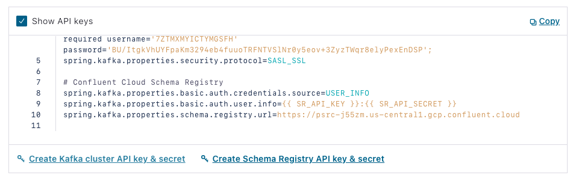
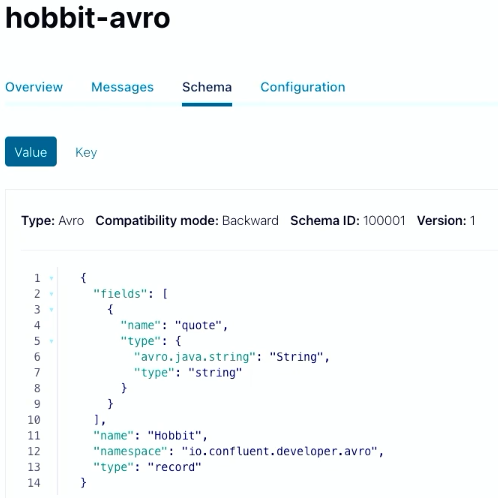

Hands On: Confluent Cloud Schema Registry and Spring Boot
=========================================================


The following continues with the program that you have worked on in
previous exercises and begins with Confluent Cloud. Even though it
continues from previous exercises, it has its own repo, which may be
found on
[GitHub](https://github.com/fenago/demo-scene/tree/master/spring-kafka-ccloud-course/spring-ccloud-avro).
(Refer there for a list of imports as well as an initial
`build.gradle` file if you need them).

### Set Up Schema Registry on Confluent Cloud

1.  On Confluent Cloud, select your environment, then **Schema
    Registry**. Select **Set up on my own**, then choose a cloud
    provider and region. Click **Continue**.

### Add an Avro Gradle Plugin

1.  Next, you're going to use an Avro Gradle plugin from
    [GitHub](https://github.com/davidmc24/gradle-avro-plugin), which
    will allow you to create Java POJOs out of Avro schemas. In
    `build.gradle`, put the following in your "Plugins"
    section:

    
    ``` {.language-gradle}
    id "com.github.davidmc24.gradle.plugin.avro" version "1.2.0"
    ```
    

2.  If you are using IntelliJ (recommended for this exercise), also add
    the following:

    
    ``` {.language-gradle}
    id "idea" 
    ```
    

    (in which case you will be able to see a new task).

3.  Still in `build.gradle`, under "Dependencies," add
    the following:

    
    ``` {.language-gradle}
    implementation 'org.apache.avro:avro:1.10.2'
    ```
    

4.  Then add this under "Repositories":

    
    ``` {.language-gradle}
    mavenCentral()

    maven {
        url "https://packages.confluent.io/maven"
    }
    ```
    

5.  Finally, in `settings.gradle`,add the following at
    the top of the file:

    
    ``` {.language-gradle}
    pluginManagement {
        repositories {
                gradlePluginPortal()
                mavenCentral()
        }
    }
    ```
    

### Create an Avro Schema and Generate Your POJOs

1.  You will use a JSON-formatted Avro schema to generate your POJOs.
    Create a new folder in `/src/main` called "Avro." In
    that folder, create a file called `hobbit.avsc`:

2.  In the file, put a schema that represents the Hobbit object:

    
    ``` {.language-avro}
    {
    "fields": [
        {
            "name": "quote",
            "type": {
                "avro.java.string": "String",
                "type": "string"
            }
        }
    ],
    "name": "Hobbit",
    "namespace": "io.confluent.developer.avro",
    "type": "record"
    }
    ```
    

    You'll store a string with a quote from the Java Faker library, then
    wrap it into a Hobbit object.

3.  Execute the Gradle task `generateAvroJava`, and in
    your `Build` directory, you should see a new folder
    called `generated-main-avro-java` that includes a
    `Hobbit` object. If you have enabled IntelliJ/Gradle
    generation, generated sources will be included in your classpath.

4.  Note that you're going to use a
    `KafkaAvroSerializer` that you need to add to
    `build.gradle`:

    
    ``` {.language-gradle}
    implementation "io.confluent:kafka-avro-serializer:6.1.0"
    ```
    

5.  In `application.properties`, you also need to
    specify the serializer (replacing the existing one):

    
    ``` {.language-java}
    spring.kafka.producer.value-serializer=io.confluent.kafka.serializers.KafkaAvroSerializer 
    ```
    

### Prepare Your Application

1.  Now change the name of the topic in your producer:

    
    ``` {.language-java}
    Flux.zip(interval, quotes)
        .map(it -> template.send("hobbit-avro", faker.random().nextInt(42), it.getT2())).blockLast();
    ```
    

2.  Then in your consumer, change the name of the topic as well as the
    types for `ConsumerRecord`:

    
    ``` {.language-java}
    @KafkaListener(topics = {"hobbit-avro"}, groupId = "spring-boot-kafka")
    public void consume(ConsumerRecord<Integer, Hobbit> record) {
            System.out.println("received = " + record.value() + " with key " + record.key());  }
    ```
    

3.  You won't need a processor or REST API so comment out
    `@Component` from your `Processor`
    class and `@RESTController`,
    `@RequiredArgsConstructor`, and
    `@GetMapping` from your
    `RestService` class.

4.  Now create a new topic in your application class:

    
    ``` {.language-java}
    @Bean
    NewTopic hobbit-avro() { return TopicBuilder.name("hobbit-avro").partitions(15).replicas(3).build();
    }
    ```
    

### Fetch Creds from Confluent Cloud

1.  In Confluent Cloud, go to **Cluster\> Clients \> Spring Boot \>
    Create Schema Registry API key & secret**:

    

2.  Check the box, add a description, then select **Continue**, and your
    credentials will be entered into the config. Copy the section under
    "Confluent Cloud Schema Registry," and return to your Java
    application and insert it into
    `application.properties`.

3.  Note the Schema Registry URL, which is your endpoint, as well as the
    authentication properties.

### Change Additional Application Parameters and Run

1.  Now change the deserializers in
    `application.properties` for your consumer:

    
    ``` {.language-java}
    spring.kafka.consumer.key-deserializer=org.apache.kafka.common.serialization.IntegerDeserializer
    spring.kafka.consumer.value-deserializer=io.confluent.kafka.serializers.KafkaAvroDeserializer
    ```
    

2.  Disable the `@EnableKafkaStreams` annotation.

3.  Run the program, and you should see
    `system.out.println` writing data in Avro format.
    You will also see it in your topic in Confluent Cloud if you go to
    **Topics \> hobbit-avro \> Messages**. Values are stored in Avro
    format so the UI can't display them.

4.  You can also now see schema under your "Schema" tab on Confluent
    Cloud.

    

### Delete Cluster

1.  This is the final exercise in the course, so make sure to delete
    your cluster. To do this, go to **Cluster settings** on the
    left-hand side menu, then click **Delete cluster**. Enter your
    cluster name, then select **Continue**.


Conclusion: Spring Framework and Apache Kafka
=============================================

In this course, you learned how you can use Spring Boot to build
event-driven microservice applications by leveraging serverless Apache
Kafka for your transport and storage layers. Hopefully, you found the
material useful and have started building your own architectures. 