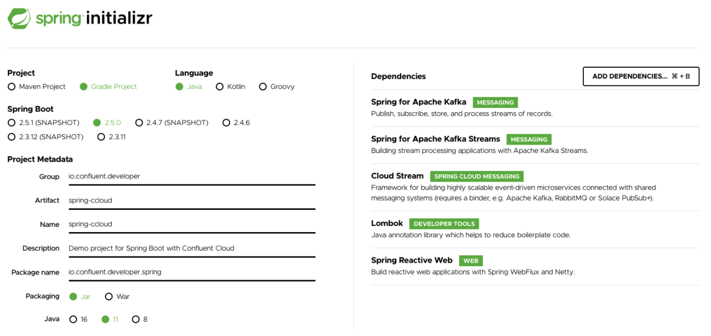
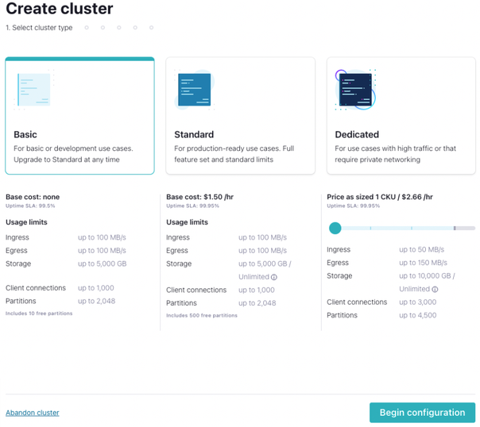
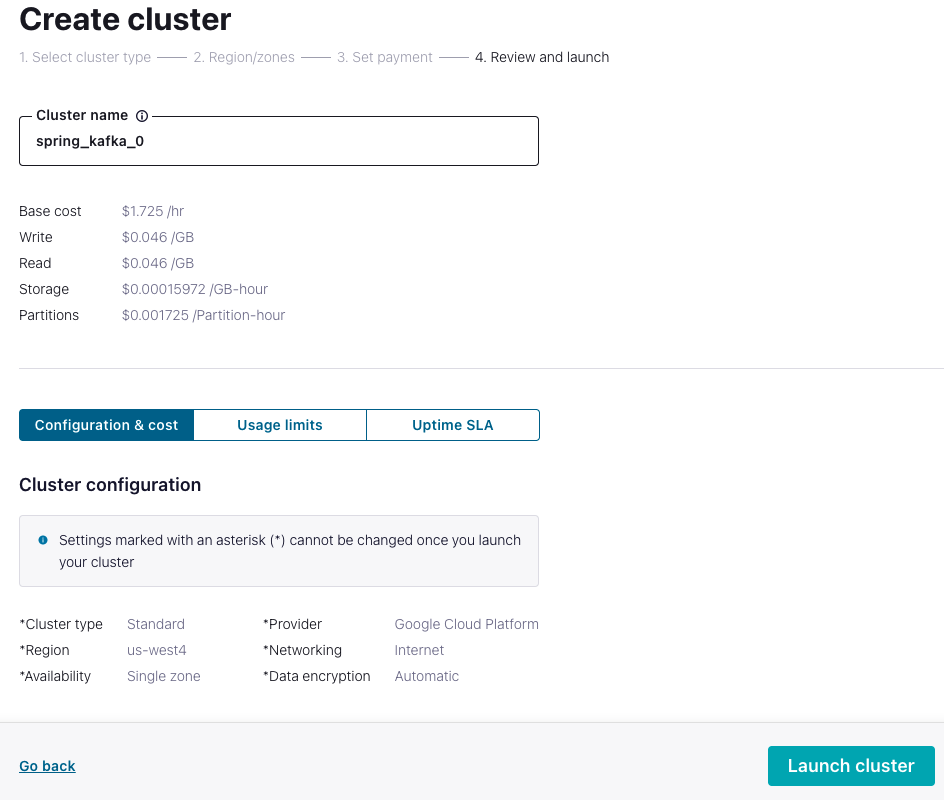
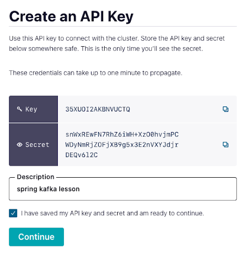

Hands On: Introduction to Spring Boot for Apache Kafka
======================================================


This exercise sets up a new Spring Boot project with Spring for Apache
Kafka and connects it with Confluent Cloud.

### Set Up and Download a Project from Spring Initializr

1.  Go to [start.spring.io](http://start.spring.io/ "start.spring.io")
    and add a new project, selecting Gradle, Java, and the default
    version of Spring Boot.

2.  Add your project's metadata as Group: "**io.confluent.developer**,"
    Artifact: "**spring-ccloud**," Description: "**Demo project for
    Spring Boot with Confluent Cloud**," and Package Name:
    "**io.confluent.developer.spring**."

    Select **Jar** packaging and Java **11**.

3.  Click the **Add Dependencies** button and add **Spring for Apache
    Kafka**, **Spring for Apache Kafka Streams**, **Cloud Stream**,
    **Lombok**, and **Spring Reactive Web**.



4.  Click **Generate** to download a ZIP archive. In your terminal,
    unzip the file:

    
    ``` {.language-sh}
    unzip spring-ccloud.zip
    ```
    

    Then open the `spring-ccloud` directory in your IDE.

### Set Up Confluent Cloud

1.  Now, open a browser and [navigate to Confluent
    Cloud](https://confluent.cloud/?iov_id=5510475e-dcfb-418a-8ca6-a075e94fa337 "navigate to Confluent Cloud")
    (if you don't have an account, you can [sign up for a free
    trial](https://www.confluent.io/confluent-cloud/tryfree " free trial")
    and use the promo code `SPRING101` for an additional
    \$101 of free usage).

2.  In the default environment, go to **Add Cluster**, then create a
    **Basic** cluster, and click **Begin configuration**.



3.  Select **Google Cloud**, a close region, and **single zone**
    availability (the associated costs are listed, but the free usage
    will be more than enough for this course). Name your cluster and
    click **Launch cluster**. Keep in mind that you should delete your
    cluster when you are finished with it to avoid extra costs.



4.  To get your Spring Boot config, go to **Clients** on the left menu
    and select **Spring Boot**. Underneath the config, select **Create
    Kafka cluster API key & secret**. Add the description **spring kafka
    lesson**, select **I have saved my API key and secret and am ready
    to continue**, and click **Continue** to populate your credentials.



### Add Confluent Cloud Credentials to Spring

1.  Copy the "\#Kafka" section of your config, click **Done**, and then
    go back to your IDE with Spring.

    
    ``` {.language-ini}
    ---
    # Kafka
    spring.kafka.properties.sasl.mechanism=PLAIN
    spring.kafka.properties.bootstrap.servers=pkc-lzvrd.us-west4.gcp.confluent.cloud:9092
    spring.kafka.properties.sasl.jaas.config=org.apache.kafka.common.security.plain.PlainLoginModule   required username='{{ CLUSTER_API_KEY }}'   password='{{ CLUSTER_API_SECRET }}';
    spring.kafka.properties.security.protocol=SASL_SSL
    ```
    

2.  Under `src/main/resources/application.properties`,
    paste the config.
