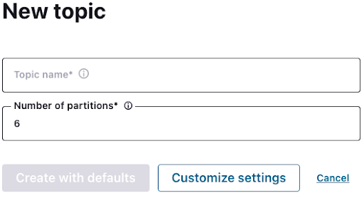

Hands On: Sending Messages to Apache Kafka with Spring Boot
===========================================================


This exercise uses the library *Java Faker* to produce from your Java
application to an [Apache
Kafka](https://www.confluent.io/what-is-apache-kafka/) topic on
Confluent Cloud. Note that this builds on the Confluent Cloud/Spring
Boot installation you did in the [Introduction to Spring Boot for
Confluent Cloud exercise].
You can see the code for modules 1--10 in a [combined GitHub
repo](https://github.com/fenago/demo-scene/tree/master/spring-kafka-ccloud-course/spring-kafka-ccloud)
and you can also refer there for a list of
[imports](https://github.com/fenago/demo-scene/blob/master/spring-kafka-ccloud-course/spring-kafka-ccloud/src/main/java/io/confluent/developer/spring/SpringCcloudApplication.java "imports")
as well as a sample `build.gradle` file.

### Add a Mock Library, a Producer, and Serialization Config

1.  Go to `build.gradle` in your Java application and
    find the `dependencies` object. Add Java Faker (you
    can find its installation string on
    [GitHub](https://github.com/DiUS/java-faker "GitHub ")):

    
    ``` {.language-gradle}
      implementation 'com.github.javafaker:javafaker:1.0.2'
    ```
    

2.  Next, begin to set up Spring Boot to send messages to Kafka. Open
    `SpringCcloudApplication.java` and create a
    `Producer` class with a Lombok annotation for
    dependency injection:

    
    ``` {.language-java}
    @RequiredArgsConstructor
      class Producer {
        private final KafkaTemplate<Integer, String> template
    }
    ```
    

    (With respect to dependency injection, it's good to use constructor
    dependency injection or property dependency injection, but not field
    dependency injection.)

3.  Next, add Java Faker code to produce some messages (from "The
    Hobbit," incidentally), and also add `Flux`, a
    reactive library that lets you push a message per second:

    
    ``` {.language-java}
     @RequiredArgsConstructor
     @Component
     class Producer {

        private final KafkaTemplate<Integer, String> template;

        Faker faker;

        @EventListener(ApplicationStartedEvent.class)
        public void generate() {

                faker = Faker.instance();
                final Flux<Long> interval = Flux.interval(Duration.ofMillis(1_000));

            final Flux<String> quotes = Flux.fromStream(Stream.generate(() -> faker.hobbit().quote()));

            Flux.zip(interval, quotes)
                .map(it -> template.send("hobbit", faker.random().nextInt(42), it.getT2())).blockLast();
        }
     }
    ```
    

    Note that `Flux.zip` lets you combine the two Flux
    parameters and enables you to send your messages to the topic
    `hobbit` on Confluent Cloud.
    `Faker.random()` generates your keys and the
    `@EventListener` annotation from Spring runs the
    class when the application is started.

4.  Now you need to tell Confluent Cloud the serialization method to use
    for keys and values by specifying it in
    `application.properties`:

    
    ``` {.language-java}
    spring.kafka.producer.key-serializer=org.apache.kafka.common.serialization.IntegerSerializer
    spring.kafka.producer.value-serializer=org.apache.kafka.common.serialization.StringSerializer
    ```
    

### Establish and Inspect Your Topic on Confluent Cloud

1.  Next, set up a topic to send to on Confluent Cloud. Go to the
    cluster you created in the [Introduction to Spring Boot for
    Confluent Cloud exercise],
    select Add topic and then create the new topic
    `hobbit`, using **Create with defaults**.



2.  Now run your application and log in to Confluent Cloud. Go to your
    cluster, then **Topics**, **hobbit**, and **Messages**, and you
    should see your first events streamed to Confluent Cloud.
