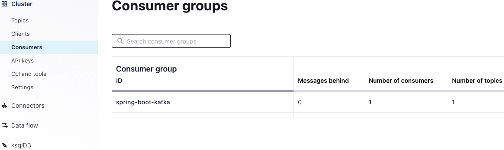
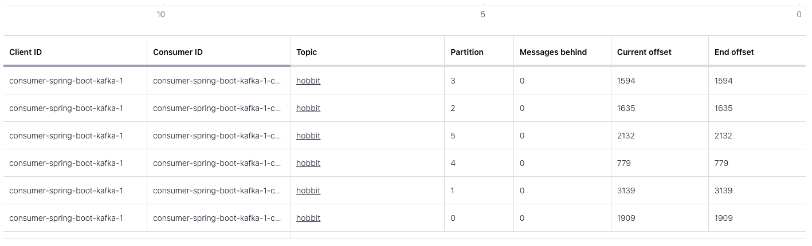
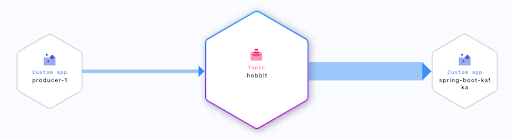

Hands On: Receiving Messages with KafkaListener
===============================================


Note that this exercise builds upon the [Introduction to Spring Boot for Confluent Cloud]
and [Sending Messages to Confluent Cloud with Spring Boot]
exercises. You can see the code for modules 1--10 in a [combined GitHub
repo](https://github.com/fenago/demo-scene/tree/master/spring-kafka-ccloud-course/spring-kafka-ccloud "GitHub repo  ")
and you can also refer there for a list of
[imports](https://github.com/fenago/demo-scene/blob/master/spring-kafka-ccloud-course/spring-kafka-ccloud/src/main/java/io/confluent/developer/spring/SpringCcloudApplication.java)
as well as a sample `build.gradle` file.

### Create a Consumer, Set a Deserializer and Inspect Your Console Data

1.  First, create a new `Consumer` class with a method
    `consume` and an annotation with the topic that
    you'd like to listen to, as well as a `groupId`. You
    can simply print the messages received:

    
    ``` {.language-java}
      @Component
      class Consumer {
          @KafkaListener(topics= {"hobbit"}, groupId="spring-boot-kafka")
          public void consume(String quote) {
              System.out.println("received= " + quote);
          } 
      } 
    ```
    

2.  You also need to specify a deserializer for your messages in
    `application.properties`:

    
    ``` {.language-ini}
    spring.kafka.consumer.key-deserializer=org.apache.kafka.common.serialization.IntegerDeserializer
    spring.kafka.consumer.value-deserializer=org.apache.kafka.common.serialization.StringDeserializer
    ```
    

    (In future lessons, you will use more complex
    serialization/deserialization types as well as schemas.)

3.  Restart your application, and you should eventually see
    `hobbit` messages arrive in your console.

### Inspect Your Data on Confluent Cloud

1.  In Confluent Cloud, go to **Consumers** on the left-side menu.



You'll see the group "spring-boot-kafka," which you specified in your
code under `groupId`. You can see that the consumer
group is using all six partitions in your topic, and you can see offsets
and consumer lag:



2.  Now if you click on **hobbit** on the same screen (under **Topic**),
    then **Data Lineage**, you can see the topic and its dependencies,
    i.e., your producer and consumer apps:



### Adjust Parameters in Your Java Application

1.  Note that you can change the names of your consumer and producer
    back in your Java application under
    `application.properties`:

    
    ``` {.language-ini}
    spring.kafka.producer.client-id=spring-boot-producer
    ```
    

2.  You can also get information about your keys by changing your
    `consume` method and injecting a
    `ConsumerRecord` for type:

    
    ``` {.language-java}
    @Component
    class Consumer {

        @KafkaListener(topics = {"hobbit"}, groupId = "spring-boot-kafka")
        public void consume(ConsumerRecord<Integer, String> record) {
          System.out.println("received = " + record.value() + " with key " + record.key());
        }
    }
    ```
    

    Run your application again and you will see keys for each message.
