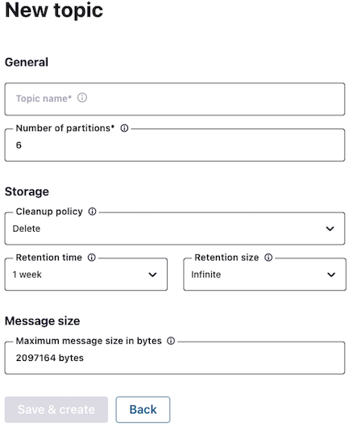

Hands On: Create Kafka Topics with TopicBuilder
===============================================


This exercise shows you how to programmatically create topics on
Confluent Cloud. You can see the code for modules 1--10 in a [combined
GitHub
repo](https://github.com/fenago/demo-scene/tree/master/spring-kafka-ccloud-course/spring-kafka-ccloud)
and you can also refer there for a list of
[imports](https://github.com/fenago/demo-scene/blob/master/spring-kafka-ccloud-course/spring-kafka-ccloud/src/main/java/io/confluent/developer/spring/SpringCcloudApplication.java)
as well as a sample `build.gradle` file.

### Add a Topic using the Confluent Cloud Console

1.  To manually create a **topic** on Confluent Cloud, go to **Topics**
    on the left-hand menu, then **Add Topic**. You can use the default
    settings, or you can customize your settings, specifying the number
    of partitions, the cleanup policy, the retention time, the maximum
    message size, etc.

    

### Create a Topic Programmatically

1.  In order to tell Spring that this particular topic should be
    created, you need to create a bean with the type of
    `NewTopic` and with the number of partitions and
    replicas specified in your application class; then use
    `TopicBuilder` to establish the topic:

    
    ``` {.language-java}
      @Bean
      NewTopic hobbit2() {
        return TopicBuilder.name("hobbit2").partitions(12).replicas(3).build();
      }
    ```
    

    Spring uses the topic configuration and automatically instantiates
    an `AdminClient` to execute the required operations.

2.  On Confluent Cloud, you should see your new
    `hobbit2` topic.

3.  Now change the number of partitions in the topic from 12 to 15:

    
    ``` {.language-java}
      @Bean
      NewTopic hobbit2() {
        return TopicBuilder.name("hobbit2").partitions(15).replicas(3).build();
      }
    ```
    

    You should see the change in Confluent Cloud. Note that because the
    topic already existed, the partitions were simply updated (had it
    not existed, a new topic would have been created).
